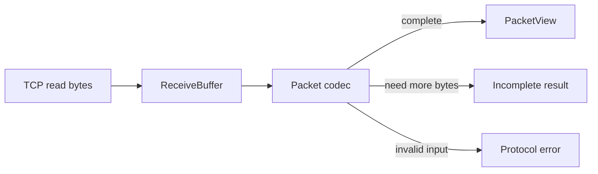
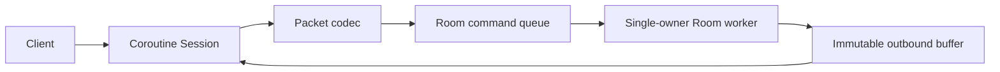

# Architecture

## Current scope

현재 구현은 TCP byte stream 위에서 사용할 패킷 경계, 오류 모델과 Session이 소유할 수신 버퍼입니다.

`PacketView`는 입력 버퍼를 소유하지 않습니다. 따라서 Session은 Packet 처리 완료 전까지 입력 버퍼의 주소가
변하거나 해제되지 않도록 보장해야 합니다. 이 제약을 타입 이름과 API 주석에 드러내어 암묵적인 수명 규칙을
줄였습니다.

`ReceiveBuffer`는 이미 처리한 byte를 offset으로 소비하고 incomplete packet은 다음 read까지 유지합니다.
완성된 `PacketView`를 처리한 뒤에만 `consume`하며, `append`와 `consume` 이후에는 이전 view를 사용하지 않습니다.
coroutine Session은 이 흐름을 실제 TCP read와 연결합니다. 현재는 하나의 I/O thread에서 Session별 read와 ping
응답 write를 직렬 실행합니다. Room command와 여러 I/O thread는 아직 구현하지 않았습니다.

## Target flow

네트워크 I/O 스레드는 게임 객체를 직접 수정하지 않습니다. 검증된 Command만 Queue에 넣고, Room Worker가
게임 상태를 단독으로 소유합니다. 이후 기준 성능을 측정한 뒤 Queue, 직렬화와 버퍼 할당 중 실제 병목이 확인된
부분만 최적화합니다.
