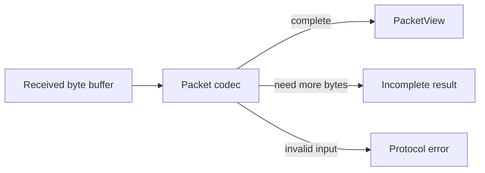
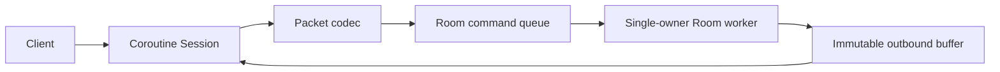

# Architecture

## Current scope

현재 구현은 TCP byte stream 위에서 사용할 패킷 경계와 오류 모델입니다.

`PacketView`는 입력 버퍼를 소유하지 않습니다. 따라서 Session은 Packet 처리 완료 전까지 입력 버퍼의 주소가
변하거나 해제되지 않도록 보장해야 합니다. 이 제약을 타입 이름과 API 주석에 드러내어 암묵적인 수명 규칙을
줄였습니다.

## Target flow

네트워크 I/O 스레드는 게임 객체를 직접 수정하지 않습니다. 검증된 Command만 Queue에 넣고, Room Worker가
게임 상태를 단독으로 소유합니다. 이후 기준 성능을 측정한 뒤 Queue, 직렬화와 버퍼 할당 중 실제 병목이 확인된
부분만 최적화합니다.
