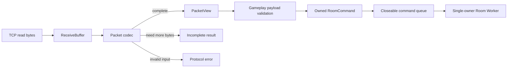
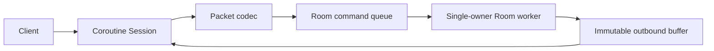

# Architecture

## Current scope

현재 구현은 TCP byte stream을 검증된 Room 명령으로 변환하고, 전용 Worker에서 게임 상태를 순차 변경합니다.

`PacketView`는 입력 버퍼를 소유하지 않습니다. 따라서 Session은 Packet 처리 완료 전까지 입력 버퍼의 주소가
변하거나 해제되지 않도록 보장해야 합니다. 이 제약을 타입 이름과 API 주석에 드러내어 암묵적인 수명 규칙을
줄였습니다.

`ReceiveBuffer`는 이미 처리한 byte를 offset으로 소비하고 incomplete packet은 다음 read까지 유지합니다.
완성된 `PacketView`를 처리한 뒤에만 `consume`하며, `append`와 `consume` 이후에는 이전 view를 사용하지 않습니다.
coroutine Session은 이 흐름을 실제 TCP read와 연결합니다. 하나의 I/O thread에서 Session별 read와 ping 응답
write를 진행하고, join, move, leave는 값 타입 `RoomCommand`로 변환해 Worker queue에 넣습니다. `PacketView`의
`span`은 수신 버퍼를 참조하므로 queue 경계를 넘기지 않습니다.

Room Worker는 별도 `std::jthread`에서 FIFO로 명령을 처리하며 Room 상태의 유일한 변경자입니다. queue의
`mutex`는 여러 Session의 submit과 Worker pop만 동기화하고, Room 내부 상태에는 lock을 두지 않습니다.

## Outbound flow

Room은 성공한 상태 변경을 Event로 반환합니다. Room Worker callback은 Event를 wire packet으로 한 번 encode하고,
Session Registry가 현재 Room 참여자들의 executor에 같은 immutable packet을 post합니다. Session별 OutboundQueue는
대기 byte 한도를 넘긴 느린 연결을 종료하며 writer coroutine 하나만 socket write를 수행합니다.

이후 기준 성능을 측정한 뒤 Queue, 직렬화와 버퍼 할당 중 실제 병목이 확인된 부분만 최적화합니다.
